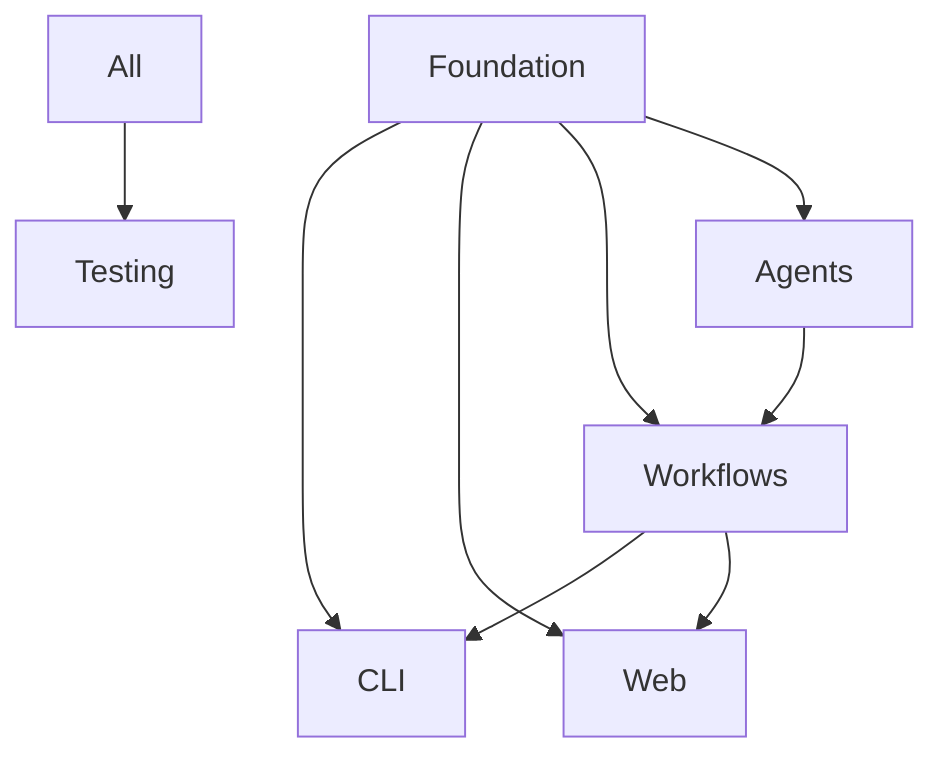

# Parallel Implementation: LlamaIndex Workflows

## Concurrent Development Strategy for Multi-Agent Systems

### Implementation Overview

```
Core Foundation (Day 1-2)
├── Agent Base Classes ──┐
├── Workflow Manager ────┤─── Integration (Day 7-8)
├── Tool Integration ────┤
└── Configuration ───────┘

Parallel Streams (Day 3-6)
├── CLI Interface ────────┐
├── Web Interface ────────┤─── Convergence (Day 9-10)  
├── Example Workflows ────┤
└── Testing Framework ────┘
```

### Day 1-2: Foundation Sprint

#### Core Infrastructure (All Streams)
```python
# Shared foundation that enables parallel work
src/llamaindex_labs/
├── __init__.py          # Package initialization
├── base.py              # Base classes for agents/workflows
├── config.py            # Configuration management
├── exceptions.py        # Custom exception classes
└── types.py             # Shared type definitions
```

#### Foundation Implementation Order
1. **Base Types & Interfaces** (Priority 1)
2. **Configuration System** (Priority 1) 
3. **Error Handling** (Priority 2)
4. **Logging Setup** (Priority 2)

### Day 3-6: Parallel Development Streams

#### Stream 1: CLI Interface Development
```bash
# Lead: CLI Developer
src/llamaindex_labs/cli/
├── __init__.py
├── main.py              # Entry point and argument parsing
├── commands.py          # Command implementations
├── config_commands.py   # Configuration management
└── interactive.py       # Interactive mode
```

**Daily Goals:**
- Day 3: CLI structure and basic commands
- Day 4: Configuration commands and validation
- Day 5: Interactive mode and help system
- Day 6: Error handling and user experience

**Dependencies:** Base classes, Configuration system

#### Stream 2: Web Interface Development  
```bash
# Lead: Frontend Developer
src/llamaindex_labs/web/
├── __init__.py
├── app.py               # Main Streamlit application
├── pages/
│   ├── workflow_selection.py
│   ├── execution_monitor.py
│   └── results_display.py
└── components/
    ├── progress_tracker.py
    └── config_panel.py
```

**Daily Goals:**
- Day 3: Streamlit app structure and basic pages
- Day 4: Workflow selection and configuration UI
- Day 5: Real-time execution monitoring
- Day 6: Results display and export features

**Dependencies:** Base classes, Workflow examples (for UI testing)

#### Stream 3: Core Workflows Implementation
```bash
# Lead: Workflow Developer  
src/llamaindex_labs/workflows/
├── __init__.py
├── base.py              # Base workflow classes
├── research_report.py   # Research workflow
├── content_pipeline.py  # Content creation workflow
└── competitive_analysis.py
```

**Daily Goals:**
- Day 3: Base workflow classes and research workflow
- Day 4: Content pipeline workflow
- Day 5: Competitive analysis workflow  
- Day 6: Error handling and optimization

**Dependencies:** Base classes, Agent implementations

#### Stream 4: Agent & Tools Development
```bash
# Lead: Agent Developer
src/llamaindex_labs/
├── agents/
│   ├── __init__.py
│   ├── base.py          # Base agent classes
│   ├── research_agent.py
│   ├── writer_agent.py
│   └── reviewer_agent.py
└── tools/
    ├── __init__.py
    ├── search_tools.py   # Tavily integration
    ├── file_tools.py     # File operations
    └── llm_tools.py      # OpenAI integration
```

**Daily Goals:**
- Day 3: Base agent classes and search tools
- Day 4: Research and writer agents
- Day 5: Reviewer agent and file tools
- Day 6: LLM tools and optimization

**Dependencies:** Base classes, Tool configurations

#### Stream 5: Testing Framework
```bash
# Lead: QA Developer
tests/
├── __init__.py
├── conftest.py          # Pytest configuration
├── test_agents.py       # Agent unit tests
├── test_workflows.py    # Workflow integration tests
├── test_cli.py          # CLI functionality tests
└── test_web.py          # Web interface tests
```

**Daily Goals:**
- Day 3: Test framework setup and agent tests
- Day 4: Workflow integration tests
- Day 5: CLI and web interface tests
- Day 6: Performance and error handling tests

**Dependencies:** All other streams (for testing)

### Day 7-8: Integration Sprint

#### Integration Checklist
- [ ] **CLI ↔ Workflows**: Command execution works
- [ ] **Web ↔ Workflows**: UI triggers workflow execution
- [ ] **Agents ↔ Tools**: Tool integrations function
- [ ] **Configuration**: All components use shared config
- [ ] **Error Handling**: Consistent across all streams
- [ ] **Logging**: Unified logging throughout system

#### Integration Testing
```python
# End-to-end integration tests
async def test_full_cli_workflow():
    result = subprocess.run([
        "llamaindex-labs", "run", "research-report", "AI trends"
    ])
    assert result.returncode == 0

async def test_full_web_workflow():
    # Selenium or Streamlit testing
    pass
```

### Day 9-10: Convergence & Polish

#### Final Integration Tasks
- [ ] Documentation consolidation
- [ ] Performance optimization
- [ ] User experience refinement
- [ ] Deployment preparation
- [ ] Final testing and validation

### Parallel Development Coordination

#### Daily Standups (15 minutes)
- **What did you complete yesterday?**
- **What will you work on today?**
- **Any blockers or dependencies?**
- **Any breaking changes to communicate?**

#### Communication Channels
```markdown
# Shared interfaces (defined early)
- Agent.process(input) -> AgentResult
- Workflow.run(input) -> WorkflowResult  
- Tool.execute(params) -> ToolResult

# Breaking change protocol
1. Announce in team chat
2. Update interface documentation
3. Coordinate dependent stream updates
4. Update integration tests
```

#### Code Integration Strategy
```bash
# Branch strategy
main                     # Stable code only
├── foundation          # Base infrastructure
├── cli-development     # CLI features
├── web-development     # Web interface
├── workflows           # Workflow implementations
├── agents-tools        # Agents and tools
└── testing            # Test framework

# Integration workflow
1. Foundation merged first (Day 2)
2. Daily integration branches (Day 3-6)
3. Full integration (Day 7-8)
4. Final convergence (Day 9-10)
```

### Dependency Management

#### Critical Path Dependencies


#### Async Interface Patterns
```python
# Enable parallel development with async interfaces
class AgentInterface(Protocol):
    async def process(self, input_data: Any) -> AgentResult:
        ...

class WorkflowInterface(Protocol):
    async def run(self, input_data: str) -> WorkflowResult:
        ...

# Teams can implement against interfaces independently
```

#### Mock Strategy for Parallel Work
```python
# CLI team can use workflow mocks
class MockWorkflow:
    async def run(self, input_data: str) -> WorkflowResult:
        await asyncio.sleep(2)  # Simulate processing
        return WorkflowResult(status="completed", content="Mock result")

# Web team can use similar mocks
# Integration replaces mocks with real implementations
```

### Quality Assurance During Parallel Development

#### Continuous Integration Per Stream
```yaml
# GitHub Actions per stream
cli_tests:
  runs-on: ubuntu-latest
  steps:
    - uses: actions/checkout@v2
    - name: Test CLI
      run: pytest tests/test_cli.py

web_tests:
  runs-on: ubuntu-latest  
  steps:
    - uses: actions/checkout@v2
    - name: Test Web Interface
      run: pytest tests/test_web.py
```

#### Integration Testing Schedule
- **Daily**: Unit tests per stream
- **Day 4, 6**: Cross-stream integration tests  
- **Day 7-8**: Full system integration tests
- **Day 9-10**: Performance and user acceptance tests

This parallel approach maximizes development velocity while maintaining code quality and system integration.